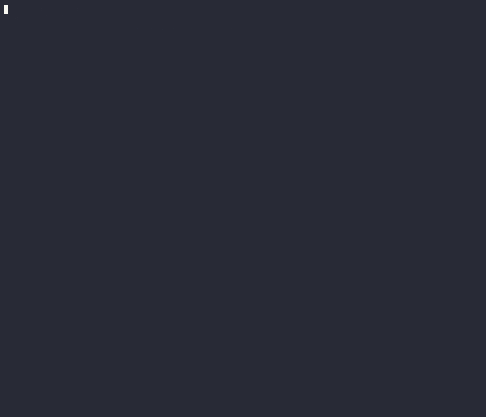
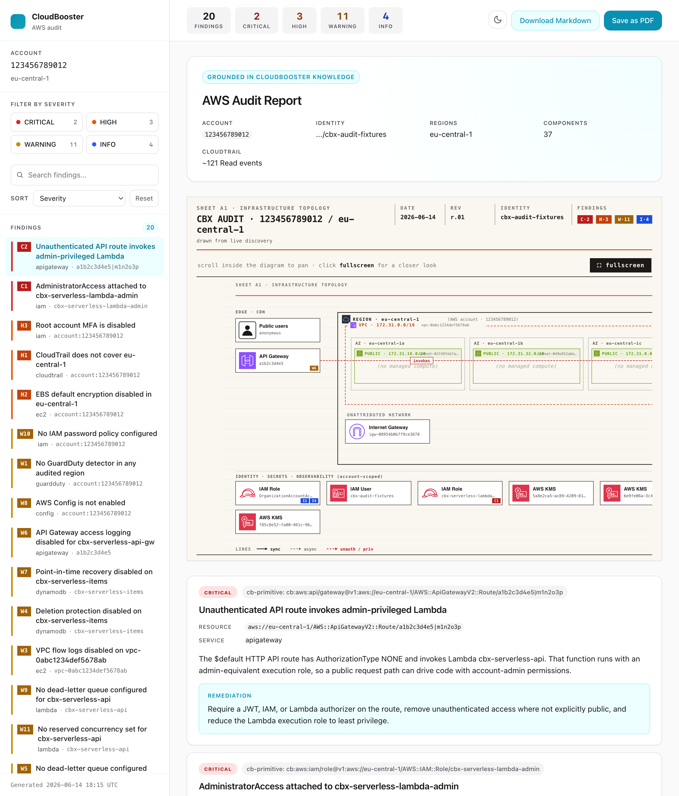

# Example: auditing a serverless stack

A complete, real `cbx audit aws` run — captured against a deliberately
misconfigured serverless stack and reproduced here end to end.

- **cbx version:** `v0.1.0`
- **Grounding executor:** Codex CLI (`--llm-executor codex`)
- **Target:** an HTTP API Gateway → an admin-privileged Lambda → a DynamoDB
  table (plus a second Lambda used as a control), in `eu-central-1`.

> All account IDs, ARNs, resource IDs and the VPC ID below are scrubbed to
> placeholders. The findings, wording, severities and grounding citations are
> exactly what `cbx` produced.

## The command

```bash
cbx audit aws --region eu-central-1
```

`cbx audit aws` reads the account through the AWS SDK (**strictly read-only**),
then grounds every finding in CloudBooster's curated AWS knowledge using a local
LLM CLI. Findings stream into an interactive TUI; on exit it writes a styled
HTML + Markdown report.

## The interactive TUI



The left pane is the severity-sorted findings list; the right pane shows the
selected finding's description, remediation, and the **CB knowledge** primitive
it's grounded in (here `aws:iam/role@v1`).

## The findings

```
20 findings    [CRITICAL] × 2    [HIGH] × 3    [WARNING] × 11    [INFO] × 4

CRITICAL · 2
  [CRITICAL]  AdministratorAccess attached to cbx-serverless-lambda-admin
  [CRITICAL]  Unauthenticated API route invokes admin-privileged Lambda

HIGH · 3
  [HIGH]  CloudTrail does not cover eu-central-1
  [HIGH]  EBS default encryption disabled in eu-central-1
  [HIGH]  Root account MFA is disabled

WARNING · 11
  [WARNING]  API Gateway access logging disabled for cbx-serverless-api-gw
  [WARNING]  AWS Config is not enabled
  [WARNING]  Deletion protection disabled on cbx-serverless-items
  [WARNING]  No GuardDuty detector in any audited region
  [WARNING]  No IAM password policy configured
  [WARNING]  No dead-letter queue configured for cbx-serverless-api
  [WARNING]  No dead-letter queue configured for cbx-serverless-worker
  [WARNING]  No reserved concurrency set for cbx-serverless-api
  [WARNING]  No reserved concurrency set for cbx-serverless-worker
  [WARNING]  Point-in-time recovery disabled on cbx-serverless-items
  [WARNING]  VPC flow logs disabled on vpc-0abc1234def5678ab

INFO · 4
  [INFO]  AdministratorAccess attached to OrganizationAccountAccessRole
  [INFO]  Audit rules: pack v1 from cache
  [INFO]  Cross-account role OrganizationAccountAccessRole has no ExternalId condition
  [INFO]  Review secret-shaped environment variables on cbx-serverless-api
```

The two CRITICALs compound into the real risk: a public API route with no
authorizer sitting in front of a Lambda that runs as account admin is an
`internet → account-takeover` path.

### Exit code

The worst finding is `critical`, so the command **exits `3`**. Audit exit codes
encode the worst finding (`0` clean · `1` info · `2` warning · `3` high/critical),
so the run is a drop-in CI gate:

```bash
# fail the pipeline on high/critical, tolerate info/warning
cbx audit aws -o json -q || [ $? -lt 3 ]
```

## The HTML report

On exit, `cbx` writes a styled, self-contained HTML report (and a Markdown
twin) next to the run:



## The architecture diagram

The report embeds a generated architecture diagram of the discovered account,
with the risky paths highlighted:


## Machine-readable output

`-o json` emits the stable `{data, error}` envelope. Every finding cites the
CloudBooster knowledge primitive that justifies it under `cb_source` — this is
the grounding, not generic advice:

```json
{
  "rule_id": "LLM-codex-ac715732",
  "title": "AdministratorAccess attached to cbx-serverless-lambda-admin",
  "description": "The Lambda execution role has the AWS managed AdministratorAccess policy attached. Any compromise or misuse of a function using this role becomes full account administration.",
  "severity": "critical",
  "resource": "aws://eu-central-1/AWS::IAM::Role/cbx-serverless-lambda-admin",
  "service": "iam",
  "remediation": "Replace AdministratorAccess with a least-privilege policy containing only the specific AWS actions and resource ARNs the Lambda functions require.",
  "cb_source": {
    "tool": "aws_lookup_primitive",
    "key": "aws:iam/role@v1",
    "snippet": "Least privilege: start with zero permissions and add only what is needed."
  }
}
```

## Prerequisites

`cbx audit aws` needs:

1. **AWS credentials** for the account you're auditing (any standard provider —
   profile, env vars, SSO). Read-only is enough.
2. **A grounding LLM CLI on your `PATH`**, authenticated — `claude`
   (default) or `codex` (`--llm-executor codex`). Verify with
   `cbx llm cli test claude-code`.
3. **Network access** to the CloudBooster knowledge API (for the curated AWS
   knowledge and the audit rule pack).

See the [full guide at docs.cloudbooster.io](https://docs.cloudbooster.io) for
the complete walkthrough.
